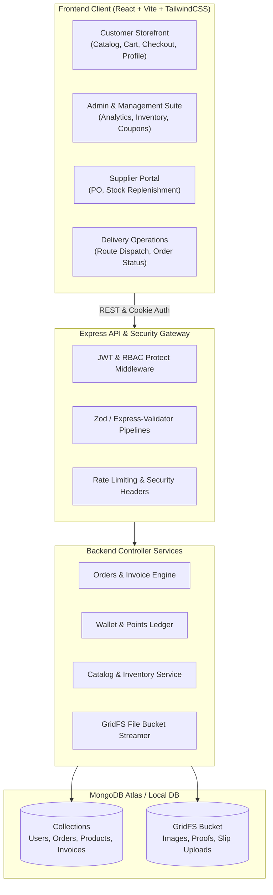

# <p align="center"></p>

<p align="center">
  <a href="#-tech-stack"></a>
  <a href="#-architecture"></a>
  <a href="#-database--storage"></a>
  <a href="#-security--auth"></a>
  <a href="#-deployment"></a>
</p>

---

## 📑 Table of Contents
- [✨ Key Highlights](#-key-highlights)
- [🧩 Architecture & Roles](#-architecture--roles)
- [🛠️ Tech Stack](#️-tech-stack)
- [📂 Directory Structure](#-directory-structure)
- [🚀 Quick Start](#-quick-start)
- [⚙️ Environment Configuration](#️-environment-configuration)
- [📦 Core Modules & Features](#-core-modules--features)
- [🛡️ Security & Validation](#️-security--validation)
- [📜 Scripts & Verification](#-scripts--verification)

---

## ✨ Key Highlights

<table>
  <tr>
    <td width="50%">
      <h3>🛍️ Customer Experience</h3>
      <ul>
        <li><b>Dynamic Catalog:</b> Multi-level category hierarchy, department navigation, and multi-filter faceted search.</li>
        <li><b>Cart & Checkout:</b> Express checkout, address management, coupon redemptions, and order tracking.</li>
        <li><b>Digital Wallet & Loyalty:</b> Built-in store wallet, refund balance management, and points loyalty program.</li>
        <li><b>PDF Invoices:</b> Auto-generated download-ready receipts powered by PDFKit.</li>
      </ul>
    </td>
    <td width="50%">
      <h3>👑 Multi-Role Operations</h3>
      <ul>
        <li><b>Role-Based Access Control (RBAC):</b> Discrete interfaces for <code>customer</code>, <code>staff</code>, <code>supplier</code>, <code>delivery</code>, and <code>admin</code>.</li>
        <li><b>Supplier Portal:</b> Purchase orders, stock replenishment, and order dispatch tracking.</li>
        <li><b>Logistics & Delivery:</b> Delivery status dispatching, timeline updates, and proof-of-delivery flows.</li>
        <li><b>Administrative Suite:</b> Dynamic coupon generation, platform analytics, inventory thresholds, and return management.</li>
      </ul>
    </td>
  </tr>
</table>

---

## 🧩 Architecture & Roles



---

## 🛠️ Tech Stack

### Frontend


### Backend & Storage


---

## 📂 Directory Structure

```text
Larvo/
├── 📁 client/                       # Frontend SPA (React + Vite + TailwindCSS)
│   ├── 📁 src/
│   │   ├── 📁 api/                  # Axios service integrations & API hooks
│   │   ├── 📁 components/           # Reusable UI primitives, Modals, Navbar, Footer
│   │   ├── 📁 context/              # Auth, Cart, & Global App State Providers
│   │   ├── 📁 pages/                # Route targets
│   │   │   ├── 📁 admin/            # Analytics, Product, Coupon, & Settings pages
│   │   │   ├── 📁 delivery/         # Logistics dashboard & order routing
│   │   │   ├── 📁 supplier/         # Purchase order & catalog supply portals
│   │   │   └── ...                  # Cart, Checkout, Wallet, Invoice, Orders
│   │   └── index.css                # Custom theme tokens & Tailwind baseline
│   └── package.json
│
├── 📁 server/                       # Backend RESTful API (Express + Mongoose + TS)
│   ├── 📁 src/
│   │   ├── 📁 config/               # Database, GridFS buckets, & environment constants
│   │   ├── 📁 controllers/          # Business logic handlers
│   │   ├── 📁 middleware/           # Auth (JWT), RBAC, Rate-limit, & Upload middleware
│   │   ├── 📁 models/               # Mongoose schemas (User, Product, Order, Wallet...)
│   │   ├── 📁 routes/               # Modular Express API endpoints
│   │   ├── 📁 services/             # Specialized helpers (PDFKit invoice generators)
│   │   ├── 📁 validators/           # Zod & Express-Validator validation rules
│   │   └── server.ts                # Express application entry & connection lifecycle
│   └── package.json
│
├── 📄 start-dev.bat                 # One-click Windows development launcher
├── 📄 VERCEL_ATLAS_GUIDE.md         # Production serverless & MongoDB Atlas manual
├── 📄 DEPLOYMENT_TROUBLESHOOTING.md  # Comprehensive deployment diagnosis guide
└── 📄 package.json                  # Root npm workspace configuration
```

---

## 🚀 Quick Start

### Prerequisites
* **Node.js**: `v18.x` or `v20.x` LTS
* **MongoDB**: Local MongoDB instance or MongoDB Atlas Connection URI
* **npm**: `v9+` or `pnpm` / `yarn`

### 1. Clone & Install
```bash
git clone https://github.com/Sasindu003/Larvo.git
cd Larvo
npm install
```

### 2. Configure Environment Variables
Create `.env` files in both the `server` and `client` directories.

#### In `server/.env`:
```env
PORT=5000
NODE_ENV=development
MONGO_URI=mongodb://localhost:27017/larvo-shop
JWT_SECRET=your_super_secret_jwt_key
JWT_EXPIRES_IN=7d
CLIENT_URL=http://localhost:5173
```

#### In `client/.env`:
```env
VITE_API_URL=http://localhost:5000/api
```

### 3. Start Development Mode

#### Option A: One-Click Windows Runner
Double-click `start-dev.bat` or run:
```cmd
.\start-dev.bat
```

#### Option B: Manual Terminal Execution
```bash
# Terminal 1 - Backend Server (Auto-Reloading via ts-node-dev)
cd server
npm run dev

# Terminal 2 - Frontend Client (Vite HMR)
cd client
npm run dev
```

Visit **Frontend**: [http://localhost:5173](http://localhost:5173) | **Backend**: [http://localhost:5000](http://localhost:5000)

---

## 📦 Core Modules & Features

| Module | Features & Capabilities |
| :--- | :--- |
| **🔐 Authentication** | Role-based authentication (`customer`, `staff`, `admin`, `supplier`, `delivery`), HTTP-only cookie tokens, and optional Google OAuth integration. |
| **🛍️ Catalog & Inventory** | Department & nested category hierarchy, stock decrement transactions, product variants, and dynamic tags. |
| **💳 Checkout & Orders** | Multi-step checkout pipeline, coupon validation, delivery address selection, and automated PDF invoice generation. |
| **👛 Wallet & Points** | Customer store credits ledger, automated refunds into wallet, and checkout points earn & burn mechanism. |
| **🚚 Delivery Tracking** | Assigned delivery agent dashboard, stage progression (`Placed` ➔ `Shipped` ➔ `Delivered`), and timestamp audit logs. |
| **🏢 Supplier Management** | Supplier directory, inbound purchase orders, and stock acquisition tracking. |
| **🖼️ MongoDB GridFS** | Complete zero-disk image lifecycle. All images and slip attachments are streamed directly into MongoDB chunks. |

---

## 🛡️ Security & Validation

* **Strict Input Validation**: Every mutating endpoint is secured with schema validations (`zod` or `express-validator`) preventing payload pollution.
* **Granular Role Protection**: Endpoints enforce JWT verification via `protect` along with `authorize('admin', ...)` middleware guards.
* **Rate Limiting**: Built-in `express-rate-limit` guards protect authentication and transaction routes from brute-force attempts.
* **Clean Data Responses**: Standardized JSON envelope:
  ```json
  {
    "success": true,
    "data": { ... },
    "message": "Operation completed successfully"
  }
  ```

---

## 📜 Scripts & Verification

| Command | Location | Description |
| :--- | :--- | :--- |
| `npm run dev` | `server/` | Boots the development server with live reload via `ts-node-dev` |
| `npm run dev` | `client/` | Starts Vite HMR local dev server |
| `npm run build` | `root` | Concurrently compiles both backend TypeScript and client assets |
| `npm run seed` | `server/` | Populates database with departments, categories, and initial products |
| `npm run test:all` | `server/` | Runs comprehensive verification check scripts across core modules |

---

<p align="center">
  <sub>Built with ❤️ for high-performance, multi-role modern fashion retail.</sub>
</p>
